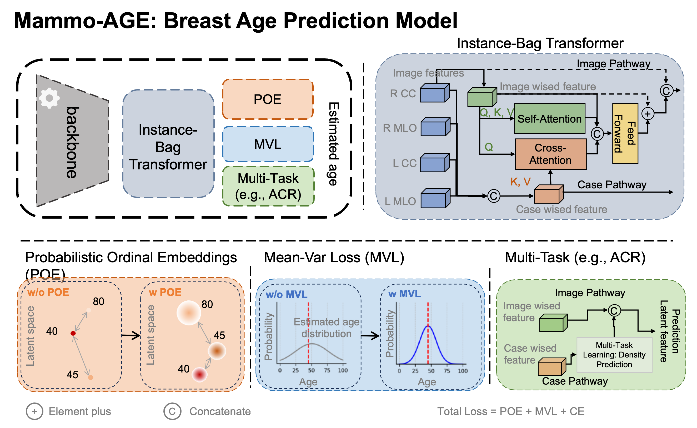

# Mammo-AGE: Deep Learning Estimation of Breast Age from Mammograms

Age is a well-known and pivotal factor relating to organ functions and health in the human body. 
For breast, biological aging of breast tissue manifests specific physiological changes distinct from chronological aging. 
This study introduces a deep learning model to estimate the biological age of the breast using healthy mammograms. 
Furthermore, we applied the model specifically for downstream breast cancer diagnosis and risk prediction. 

[//]: # (![img.png]&#40;./figures/img.png&#41;)


## Environment Setup

Use [environment.yml](./environment.yml) to setup the environment.

```bash
git clone git@github.com:xinwangxinwang/Mammo-AGE.git
cd Mammo-AGE
conda env create --name Mammo-AGE -f environment.yml
conda activate Mammo-AGE
```

Mammo-AGE is implemented with following specification:

* Python version: 3.10.13
* PyTorch version: 2.4.0
* CUDA version: 12.1

## [Mammo-AGE Model](./mammo_age/README.md)

[//]: # (![Prediction.pdf]&#40;./figures/Prediction.png&#41;)
[//]: # ()

### For detailed training and evaluation scripts, refer to the following [`Train-README`](./mammo_age/README.md)

```bash
# Example training
sh /script/Mammo-AGE_Training/sbatch/train_example.sh

# Example predicting
sh /script/Mammo-AGE_Training/sbatch/predict_example.sh
```

## [Mammo-AGE Model finetune on downstream tasks](./mammo_age_finetune/README.md)

### For detailed training and evaluation scripts, refer to the following [`Finetune-README`](./mammo_age_finetune/README.md)

[//]: # (![finetune.pdf]&#40;./figures/Finetune.png&#41;)
[//]: # ()


```bash
# Example training
sh /script/Downstream_Finetune/sbatch/train_example.sh

# Example predicting
sh /script/Downstream_Finetune/sbatch/predict_example.sh
```

The configs above are meant to specify exact implementation details and our experimental procedure
and may need to be adjusted to your specific use case.


## Disclaimer
This code and accompanying pretrained models are provided with no guarantees
regarding their reliability, accuracy or suitability for any particular
application and should be used for research purposes only. The models and code
are not to be used for public health decisions or responses, or for any
clinical application or as a substitute for medical advice or guidance.


## Citation
If you use this code or models in your scientific work, please cite the following paper:
```bibtex
Coming soon!
```

## Acknowledgements
This work is based on the following repositories: 
[POEs](https://github.com/Li-Wanhua/POEs),
[Global-LocalTransformer](https://github.com/shengfly/global-local-transformer),
[Mean-Variance Loss](https://openaccess.thecvf.com/content_cvpr_2018/html/Pan_Mean-Variance_Loss_for_CVPR_2018_paper.html),
[Mirai](https://github.com/yala/Mirai), and
[BreaCR](https://github.com/xinwangxinwang/BreaCR).


## License
The code is Apache 2.0 licensed, as found in the [LICENSE file](LICENSE)

## Contact details
If you have any questions, please contact us. 

Email: ritse.mann@radboudumc.nl (Ritse Mann); taotanjs@gmail.com (Tao Tan); x.wang@nki.nl (Xin Wang)

Links: [Netherlands Cancer Institute](https://www.nki.nl/), 
[Radboud University Medical Center](https://www.radboudumc.nl/en/patient-care) and 
[Maastricht University](https://www.maastrichtuniversity.nl/nl)
